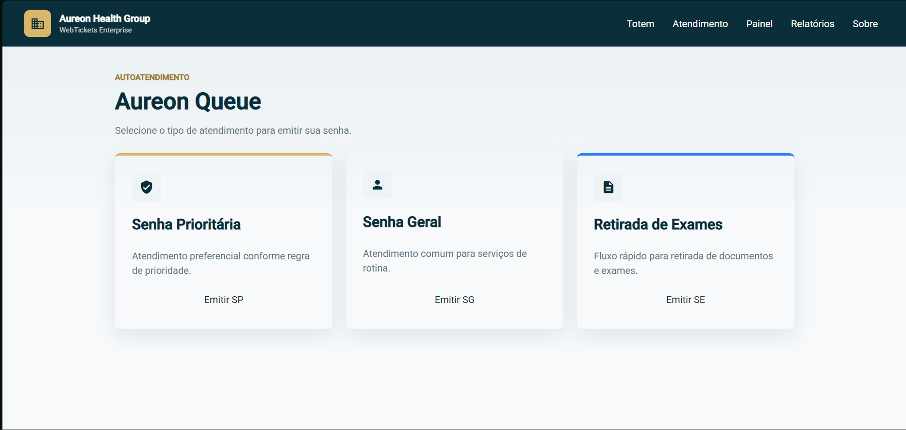
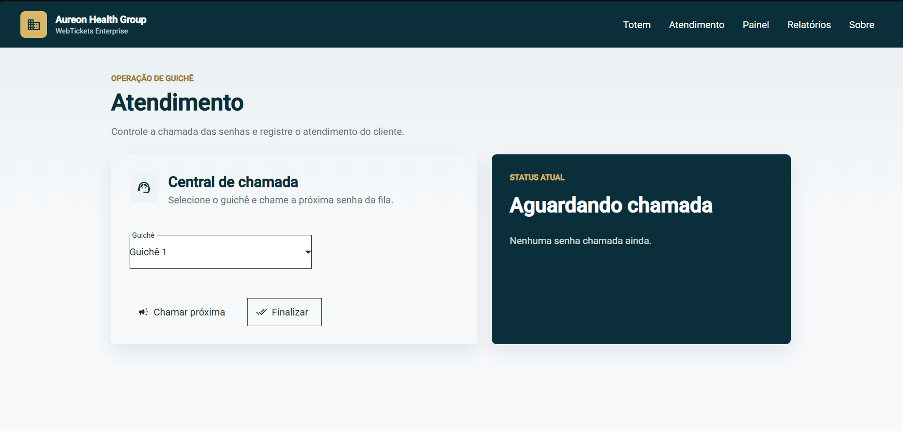
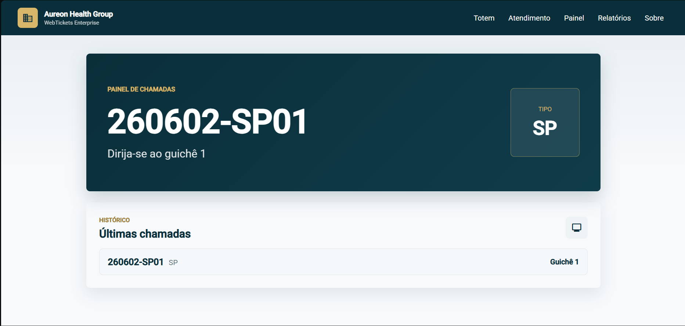
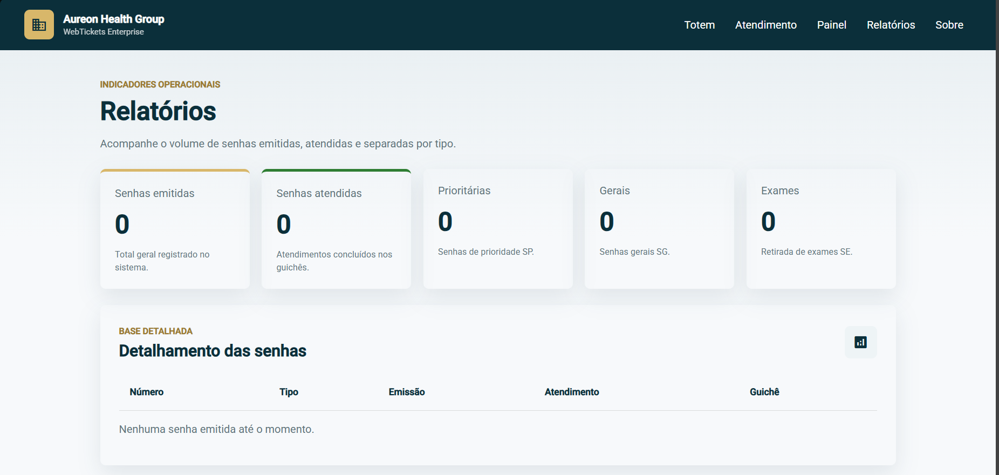
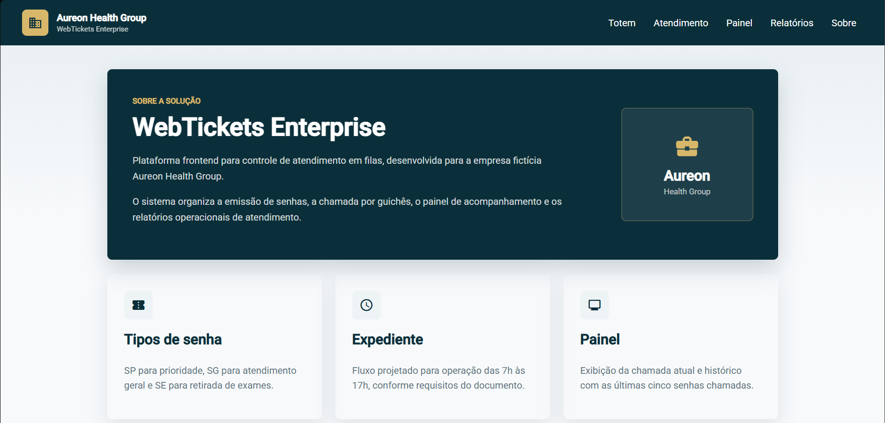

# WebTickets

Sistema frontend para controle de atendimento em filas, desenvolvido em Angular com Angular Material.

## Empresa fictícia

Aureon Health Group

## Sobre o projeto

O WebTickets Enterprise é uma solução frontend para emissão, chamada e acompanhamento de senhas em ambientes de atendimento, como laboratórios médicos.

O projeto foi desenvolvido com foco em uma interface limpa, profissional e empresarial, seguindo os requisitos de controle de atendimento em filas apresentados no documento da atividade.

A aplicação simula o fluxo de atendimento com emissão de senhas, chamada por guichê, painel público de acompanhamento e relatório operacional.

## Objetivo

Praticar a construção de um frontend em Angular utilizando componentes do Angular Material, organização por páginas, rotas e serviços.

O sistema busca representar, de forma simplificada, uma solução de atendimento para ambientes corporativos e laboratórios médicos.

## Funcionalidades

- Emissão de senhas prioritárias, gerais e para retirada de exames
- Chamada da próxima senha por guichê
- Finalização do atendimento atual
- Painel com senha atual e últimas chamadas
- Relatórios com senhas emitidas e atendidas
- Exibição da quantidade de senhas por tipo
- Interface responsiva, limpa e profissional

## Regras de atendimento

O sistema trabalha com três tipos de senha:

- SP - Senha Prioritária
- SG - Senha Geral
- SE - Retirada de Exames

A chamada das senhas segue uma ordem simplificada de prioridade:

1. Senhas prioritárias
2. Senhas para retirada de exames
3. Senhas gerais

Cada senha gerada segue o modelo:

```txt
YYMMDD-PPSQ
```

Onde:

- `YY` representa o ano
- `MM` representa o mês
- `DD` representa o dia
- `PP` representa o tipo da senha
- `SQ` representa a sequência da senha

Exemplo:

```txt
260602-SP01
```

## Tecnologias utilizadas

- Angular
- Angular Material
- TypeScript
- SCSS
- HTML

## Estrutura principal do projeto

```txt
src/app
├── pages
│   ├── atendimento
│   ├── painel
│   ├── relatorios
│   ├── sobre
│   └── totem
├── services
│   └── tickets.service.ts
├── app-routing-module.ts
├── app.html
├── app.scss
└── material.module.ts
```

## Telas do projeto

### Totem

Tela destinada à emissão de senhas pelo cliente.



### Atendimento

Tela utilizada pela atendente para selecionar o guichê, chamar a próxima senha e finalizar o atendimento.



### Painel

Tela de acompanhamento para exibição da senha chamada e das últimas chamadas realizadas.



### Relatórios

Tela com indicadores operacionais e detalhamento das senhas emitidas e atendidas.



### Sobre

Tela institucional com informações sobre a solução WebTickets Enterprise.



## Como executar o projeto

Para executar o projeto localmente, é necessário ter o Node.js e o Angular CLI instalados.

Clone o repositório:

```bash
git clone https://github.com/Gheovana/WebTickets.git
```

Acesse a pasta do projeto:

```bash
cd WebTickets
```

Instale as dependências:

```bash
npm install
```

Execute o projeto:

```bash
ng serve
```

Acesse no navegador:

```txt
http://localhost:4200
```

## Como navegar no sistema

Após iniciar o projeto, utilize o menu superior para acessar as páginas:

- **Totem:** emissão de novas senhas
- **Atendimento:** chamada e finalização de atendimentos
- **Painel:** visualização da senha atual e últimas chamadas
- **Relatórios:** acompanhamento dos dados de atendimento
- **Sobre:** informações institucionais do projeto

## Integrantes do grupo

Este projeto foi desenvolvido por uma equipe composta por 4 integrantes.

|                Nome                 | Matrucula |
|                ---                  |    ---    |
| Gheovana Pietra Araújo dos Santos   |  01799514 |
| Nathalia de Araújo Silva            |  01379923 |
| Sérgio José Galdino Da Silva Júnior |  01800630 |
| Maria Vitória Albuquerque Cunha     |  01797764 |

## Licença

Este projeto está licenciado sob a licença MIT.